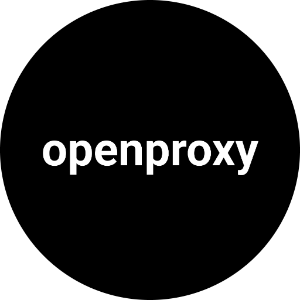
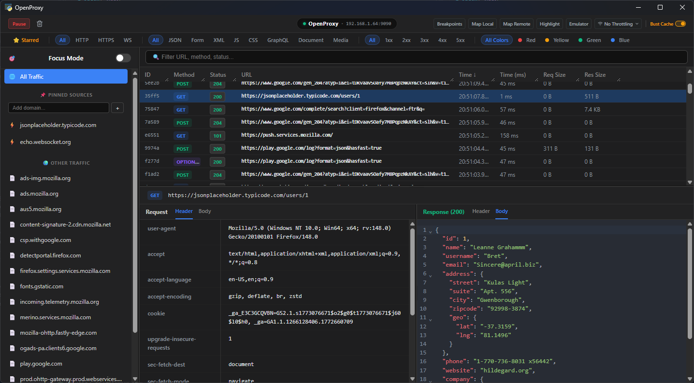

#  OpenProxy

OpenProxy is a fast, modern, lightweight network debugging proxy built for developers. It combines the raw power of `mitmproxy` with a sleek, native-feeling desktop UI built in Vue.js and Python (`pywebview`).

Whether you need to mock API responses, rewrite routing rules on the fly, throttle your network, or automatically inject SSL certificates into an Android emulator, OpenProxy handles it without the bloat of traditional Java-based proxies.



## ✨ Key Features

* **Traffic Interception**: View, inspect, and filter HTTP/HTTPS requests in real-time.
* **Map Local (Mocking)**: Trick your app into receiving custom JSON/HTML responses without touching your backend.
* **Map Remote (Rewrites)**: Transparently route production URLs to your `localhost` development server.
* **Live Breakpoints**: Pause requests or responses mid-flight, edit their headers/bodies, and release them.
* **Smart Android Setup**: 1-click ADB integration. Automatically detects rooted emulators to inject System Certificates, or gracefully falls back to User Certificates.
* **Network Throttling**: Simulate "Fast 3G" or "Slow 3G" network conditions.
* **Aggressive Cache Busting**: One-click toggle to strip caching headers and force fresh responses.
* **Pro-Grade UI**: Ultra-compact filter chips, dark mode, right-click context menus, and split-pane layout.

---

## 🛠️ Tech Stack

* **Backend**: Python 3, `mitmproxy` (Core proxy engine), `websockets`
* **Frontend**: Vue 3, Vite, raw CSS (No bulky component libraries)
* **Bridge**: `pywebview` (Renders the Vue app in a native OS window)

---

## 💻 Local Development Setup

To work on OpenProxy, you need to run both the Vue frontend and the Python backend.

### 1. Prerequisites
* Python 3.10+
* Node.js 18+
* ADB (Android Debug Bridge) installed and in your system PATH (for Android features)
* OpenSSL (for Android root certificate hashing)

### 2. Install Dependencies

**Frontend:**
```bash
cd ui
npm install
```

**Backend:**
```bash
# Return to the root directory
cd ..
python3 -m venv venv
source ./venv/bin/activate
pip install mitmproxy pywebview websockets
```

### 3. Run the App in Dev Mode
First, build the UI (or run the Vite dev server if you are editing Vue files):
```bash
cd ui
npm run build
```
Then, run the Python application:
```bash
cd ..
python main.py
```

---

## 📦 Building Native Executables (Production)

You can bundle OpenProxy into a single `.exe` (Windows) or `.app` (macOS) using PyInstaller. This allows you to run the app without a terminal window and share it with others.

### 1. Prepare the Build
1. Ensure your Vue app is fully built: `cd ui && npm run build`
2. Ensure you have your icon files in the root directory:
   * `icon.ico` (for Windows)
   * `icon.icns` (for macOS)
   * `icon.png` (for the internal pywebview window icon)

### 2. Install PyInstaller
```bash
pip install pyinstaller
```

### 3. Generate the Build

**⚠️ Important:** You must build the Windows `.exe` on a Windows machine, and the macOS `.app` on a Mac.

**🍎 For macOS:**
Run this in your terminal from the root project folder:
```bash
pyinstaller --name "OpenProxy" \
  --windowed \
  --icon=icon.icns \
  --add-data "ui/dist:ui/dist" \
  --add-data "icon.png:." \
  main.py
```
*Note: macOS uses a colon (`:`) to separate paths in `--add-data`.*

**🪟 For Windows:**
Run this in Command Prompt or PowerShell from the root project folder:
```bash
pyinstaller --name "OpenProxy" ^
  --noconsole ^
  --icon=icon.ico ^
  --add-data "ui/dist;ui/dist" ^
  --add-data "icon.png;." ^
  main.py
```
*Note: Windows uses a semicolon (`;`) to separate paths in `--add-data`.*

### 4. Locate your App
Once PyInstaller finishes, it will create a `dist/` folder in your project directory. Inside, you will find your standalone `OpenProxy` executable!

---

## 🤖 Android Certificate Notes

Modern Android (API 24+) ignores user-installed certificates by default. To intercept traffic from your own apps:
1. **The Easy Way (Root)**: Create a "Google APIs" emulator (NOT "Google Play"). Run it from the terminal with `emulator -avd <name> -writable-system`. Click OpenProxy's "Emulator" button to automatically inject the system cert.
2. **The App Config Way (Non-Root)**: Add a `network_security_config.xml` to your Android Studio project to explicitly trust user certificates during debug mode.

##  iOS Certificate Notes

The iOS Simulator on macOS shares your Mac's network stack, so you configure the Mac's proxy settings — the simulator inherits them automatically. Step-by-step:
  1. Start OpenProxy — note the proxy port (starts at 9090) and your local IP shown in the UI.
  2. Set your Mac's HTTP/HTTPS proxy:
    - System Settings → Network → Wi-Fi → Details → Proxies
    - Enable Web Proxy (HTTP) and Secure Web Proxy (HTTPS)
    - Server: your local IP (e.g. 192.168.1.x) or 127.0.0.1
    - Port: the port shown in OpenProxy (e.g. 9090)
  3. Boot the iOS Simulator, open Safari, and go to: ```http://mitm.it```
  4. Download the mitmproxy certificate profile from that page.
  5. Install the profile:
    - Settings → General → VPN & Device Management → Install the downloaded profile
  6. Enable certificate trust (critical for HTTPS):
    - Settings → General → About → Certificate Trust Settings → Toggle ON the mitmproxy cert

Important notes:

  - The simulator uses your Mac's network, so the Mac system proxy is what matters — you don't configure proxy settings on the simulator itself.
  - You must enable certificate trust in step 6, or HTTPS traffic won't be intercepted.
  - When you're done, remember to disable the Mac's proxy settings, otherwise your Mac's regular traffic will also route through OpenProxy.

The setup instructions are also available directly in the app — click the device setup button in the toolbar and select the iOS Simulator tab.
