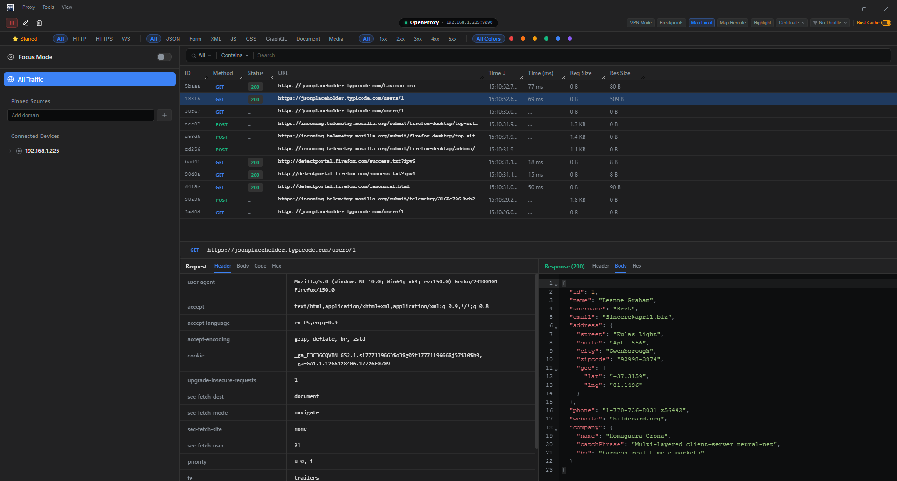

#  OpenProxy

OpenProxy is a fast, modern, lightweight network debugging proxy built for developers. It combines the raw power of `mitmproxy` with a sleek, native-feeling desktop UI built in **Electron**, **Vue 3**, and **Python**.

Whether you need to mock API responses, rewrite routing rules on the fly, throttle your network, or automatically inject SSL certificates into an Android emulator, OpenProxy handles it without the bloat of traditional Java-based proxies.



## 📑 Table of Contents

- [✨ Key Features](#-key-features)
- [📥 Installation](#-installation)
- [🤖 Android Setup](#-android-setup)
- [🍎 iOS Setup](#-ios-setup)
- [🖥️ Desktop & Browser Setup](#️-desktop--browser-setup)
- [🛠️ Tech Stack](#️-tech-stack)
- [💻 Local Development](#-local-development)
- [📦 Building for Distribution](#-building-for-distribution)
- [🔄 Auto-Update](#-auto-update)

---

## ✨ Key Features

* **Traffic Interception**: View, inspect, and filter HTTP/HTTPS requests in real-time.
* **Map Local (Mocking)**: Trick your app into receiving custom JSON/HTML responses without touching your backend.
* **Map Remote (Rewrites)**: Transparently route production URLs to your `localhost` development server.
* **Live Breakpoints**: Pause requests or responses mid-flight, edit their headers/bodies, and release them.
* **VPN Mode**: Route device traffic through a WireGuard tunnel — no manual proxy configuration needed. Available for Android and iOS physical devices.
* **Smart Android Setup**: 1-click ADB integration. Automatically detects rooted emulators to inject System Certificates, or gracefully falls back to User Certificates.
* **Network Throttling**: Simulate "Fast 3G" or "Slow 3G" network conditions.
* **Aggressive Cache Busting**: One-click toggle to strip caching headers and force fresh responses.
* **Auto-Update**: The app checks for new releases on startup and can update itself in one click.
* **Pro-Grade UI**: Ultra-compact toolbar, dark mode, right-click context menus, and split-pane layout.

---

## 📥 Installation

Download the latest release for your platform from the [GitHub Releases](https://github.com/TiagoParente32/open-proxy/releases) page.

### macOS

OpenProxy isn't currently signed with an Apple Developer certificate, so macOS Gatekeeper will refuse to open it and show **"OpenProxy is damaged and can't be opened"** (or a similar warning) after you drag it into `/Applications`. This is expected for an unsigned app downloaded from the internet — not actual corruption. To fix it, run the following in Terminal to remove the quarantine flag macOS applies to downloaded files:

```bash
xattr -cr /Applications/OpenProxy.app
```

Then open the app normally. You only need to do this once per install/update.

### Windows

Windows SmartScreen may warn that the app is from an unrecognized publisher (also due to the lack of code signing). Click **More info → Run anyway** to proceed.

### Linux

Install the `.deb`/`.rpm` package with your system's package manager, or make the `.AppImage` executable (`chmod +x`) and run it directly.

---

## 🤖 Android Setup

OpenProxy supports both **Android emulators** and **physical Android devices**. Full step-by-step guides are also available in-app — open **Devices** in the toolbar.

### Android Emulator (recommended for development)

1. **Automated (root) setup**: Create a "Google APIs" emulator (**not** "Google Play" — those images are non-rooted). Start it normally from Android Studio or the command line — no special flags needed. Then in OpenProxy, open the **Devices** setup and click your emulator — it runs `adb root` and pushes the mitmproxy certificate directly, so no writable-system remount is required.

   > If the automated install fails (e.g. `adb root` is rejected, or the image turns out not to be rooted), fall back to visiting `http://mitm.it` in the emulator browser and installing the certificate manually as described in step 2 below — just in case.
2. **Manual (non-root) setup**: In the emulator, go to **Settings → Network & Internet → Internet**, long-press your Wi-Fi network → **Modify network → Advanced options**, and set **Proxy** to **Manual** using host `10.0.2.2` and the port shown in OpenProxy's toolbar (starts at `9090`). Then visit `http://mitm.it` in the emulator browser to download and install the certificate under **Settings → Security → Encryption & Credentials → Install a certificate → CA Certificate**.
3. **App-level HTTPS interception**: Modern Android (API 24+) ignores user-installed certificates by default for apps you build yourself. Add a `network_security_config.xml` referenced from `AndroidManifest.xml` to explicitly trust user certificates in debug builds — OpenProxy's **App Config** tab generates both files for you (with notes for React Native / Flutter / Expo projects).

### Physical Android Device

1. Ensure your phone and computer are on the **same Wi-Fi network**.
2. Go to **Settings → Wi-Fi**, tap the gear next to your network, set **Proxy** to **Manual**, and enter the hostname/port shown in OpenProxy.
3. Open the browser on your phone, go to `http://mitm.it`, and tap the **Android** button to download the certificate.
4. Install it via **Settings → Security → Encryption & Credentials → Install a certificate → CA Certificate**.

### VPN Mode (physical devices, no manual proxy config)

Instead of setting a manual proxy, enable **VPN Mode** in OpenProxy (toolbar or Devices modal → **VPN Mode** tab). It starts a local WireGuard tunnel and shows a QR code:

1. Install the **WireGuard** app on your Android device.
2. Tap **+ → Create from QR code** and scan the code shown in OpenProxy (or import the config file).
3. Activate the tunnel — all device traffic now routes through OpenProxy automatically.
4. With the tunnel active, open a browser and go to `http://mitm.it` to download and install the CA certificate as above.

---

## 🍎 iOS Setup

### iOS Simulator (macOS only)

The iOS Simulator shares your Mac's network stack, so setup is almost entirely automated — no manual `mitm.it` visit or profile install needed.

1. Start OpenProxy, open **Devices** in the toolbar, and select the **iOS Simulator** option.
2. Toggle the **macOS system proxy** switch on — OpenProxy prompts for your admin password once (via `networksetup`) and routes all Mac (and simulator) traffic through itself.
3. Pick a **Booted** simulator from the list and click it — OpenProxy runs `xcrun simctl keychain <udid> add-root-cert` to install and trust the mitmproxy certificate directly, with no manual profile download or Certificate Trust Settings toggle required.

   > If the automated install ever fails or HTTPS requests still show certificate errors, visit `http://mitm.it` in Safari inside the simulator and install the profile manually (see the fallback steps below) — just in case.

> **Note:** `simctl` only trusts the certificate inside the **simulator's** own TrustStore — it does not touch the Mac's System keychain. Turning on the macOS system proxy routes **all** Mac traffic through OpenProxy, so if you also browse HTTPS sites in Safari/Chrome on the Mac itself (outside the simulator), you'll need to separately install and trust the cert on macOS: visit `http://mitm.it` in a Mac browser, download the macOS certificate, then trust it via Keychain Access (**Always Trust**).

> Remember to turn the macOS system proxy back off when you're done, so your regular traffic stops routing through OpenProxy.

If you'd rather not enable the system-wide proxy (or need it for a real device instead), you can still do it manually:

1. Set your Mac's HTTP/HTTPS proxy: **System Settings → Network → Wi-Fi → Details → Proxies** — enable **Web Proxy (HTTP)** and **Secure Web Proxy (HTTPS)**, using your local IP (e.g. `192.168.1.x`) or `127.0.0.1` and the port shown in OpenProxy.
2. In the iOS Simulator, open Safari and go to `http://mitm.it`, then download and install the mitmproxy certificate profile.
3. Enable certificate trust: **Settings → General → About → Certificate Trust Settings** — toggle the mitmproxy cert **ON**.

The full setup guide is also available in-app — open **Devices** in the toolbar and select the iOS Simulator tab.

### Physical iOS Device

1. Ensure your iPhone and computer are on the **same Wi-Fi network**.
2. Go to **Settings → Wi-Fi → (i) → Configure Proxy → Manual** and enter the server/port shown in OpenProxy.
3. Open Safari, go to `http://mitm.it`, and tap the **iOS** button to download the certificate profile.
4. Install it via **Settings → General → VPN & Device Management**.
5. **Crucial**: go to **Settings → General → About → Certificate Trust Settings** and toggle mitmproxy **ON** — skipping this step causes SSL errors on all HTTPS traffic.

### VPN Mode (physical devices, no manual proxy config)

Same flow as Android: enable **VPN Mode** in OpenProxy, scan the QR code (or import the config) with the WireGuard app on your iPhone, activate the tunnel, then visit `http://mitm.it` to install and trust the certificate as described above.

---

## 🖥️ Desktop & Browser Setup

Open the **Devices** setup in OpenProxy and select the **Browser** option to see per-browser instructions and copy-ready values. Summary:

### Chrome
Chrome uses the OS system proxy. Set your system proxy (macOS: System Settings → Network → Details → Proxies; Windows: Settings → Network → Proxy) to OpenProxy's IP/port, then visit `http://mitm.it` in Chrome to install the certificate. On macOS, trust it via Keychain Access (**Always Trust**); on Windows, import the `.p12` into **Trusted Root Certification Authorities**.

### Firefox
Firefox has its own independent proxy settings and certificate store. Configure a manual proxy under **Settings → General → Network Settings**, check **Also use this proxy for HTTPS**, then import the certificate from `http://mitm.it` under **Settings → Privacy & Security → Certificates → View Certificates → Authorities → Import**, and check **Trust this CA to identify websites**.

### Safari
Safari uses macOS system proxy and certificate settings — configure proxies under **System Settings → Network → Details → Proxies**, then visit `http://mitm.it` in Safari and trust the certificate via Keychain Access.

### curl / CLI tools
Export `http_proxy` / `https_proxy` environment variables pointing at OpenProxy, or pass `-x` directly to curl along with `--cacert ~/.mitmproxy/mitmproxy-ca-cert.pem` (macOS/Linux) or `%USERPROFILE%\.mitmproxy\mitmproxy-ca-cert.pem` (Windows). This works for curl, wget, pip, npm, and most HTTP clients.

---

## 🛠️ Tech Stack

| Layer | Technology |
|---|---|
| **Backend** | Python 3, `mitmproxy` (proxy engine), `websockets` |
| **Frontend** | Vue 3, Vite, raw CSS (no component libraries) |
| **Desktop shell** | Electron — serves the Vue app and manages the Python subprocess |

The app is structured as three loosely coupled pieces:
- **Electron** (`electron/`) — the native window, OS menus, tray icon, and IPC bridge. It spawns the Python backend on startup and loads the built Vue frontend.
- **Vue UI** (`ui/`) — the entire interface, communicating with the Python backend over a local WebSocket.
- **Python backend** (`main.py`) — runs `mitmproxy` and streams proxy state to the UI.

---

## 💻 Local Development

### Prerequisites

* Node.js 18+
* Python 3.10+
* ADB (Android Debug Bridge) in your system PATH *(Android features only)*p
* OpenSSL *(Android root certificate hashing only)*

### 1. Install Dependencies

**Electron & root deps:**
```bash
npm install
```

**Vue frontend:**
```bash
cd ui && npm install && cd ..
```

**Python backend:**
```bash
python3 -m venv venv
source venv/bin/activate   # Windows: venv\Scripts\activate
pip install -r requirements.txt
```

### 2. Run in Dev Mode

```bash
# macOS / Linux
./run.sh

# Windows
.\run.ps1
```

This launches Electron. On startup Electron will:
1. Build the Vue UI automatically (`npm run build` inside `ui/`)
2. Spawn the Python backend from the local `venv`
3. Load the built UI in the window

> The Python backend and the Vue frontend communicate over a local WebSocket — there is no HTTP server involved in serving the UI.

---

## 📦 Building for Distribution

The build is a **3-step pipeline**: Vue UI → Python binary (PyInstaller) → Electron installer (electron-builder).

### macOS

```bash
./build.sh          # → DMG (arm64 + x64) in dist-electron/
./build.sh --dir    # unpackaged app only (faster, for testing)
```

> Must be run on a Mac. Produces both Apple Silicon and Intel builds in one run.

#### ⚠️ "OpenProxy is damaged and can't be opened"

The build isn't code-signed, so macOS Gatekeeper will quarantine it just like a downloaded release. See [Installation → macOS](#-installation) for the `xattr -cr` fix.

### Windows

```powershell
.\build.ps1         # → NSIS .exe installer + .zip in dist-electron\
.\build.ps1 --dir   # unpackaged app only (faster, for testing)
```

> Must be run on a Windows machine.

### Linux

```bash
# Install required packaging tools (first time only)
sudo apt install fakeroot dpkg rpm

./build-linux.sh            # → .deb + .rpm + .AppImage + .tar.gz (x64) in dist-electron/
./build-linux.sh --arm64    # → same targets for arm64 (must run on arm64 hardware)
./build-linux.sh --dir      # unpackaged app only (fastest, for testing)
```

> `.deb` and `.rpm` can both be built from Ubuntu in one run — no Fedora machine needed.
> arm64 builds require arm64 hardware because PyInstaller compiles native binaries.

### What each step produces

| Step | Tool | Output |
|---|---|---|
| 1. Vue UI | Vite | `ui/dist/` |
| 2. Python backend | PyInstaller | `backend-dist/OpenProxy-server/` |
| 3. Installer | electron-builder | `dist-electron/` |

### Distribution targets

| Platform | Targets | Notes |
|---|---|---|
| macOS | `.dmg`, `.zip` (arm64 + x64) | DMG for fresh install, ZIP used by auto-update |
| Windows | NSIS `.exe`, `.zip` | EXE for fresh install, ZIP used by auto-update |
| Linux | `.deb`, `.rpm`, `.AppImage`, `.tar.gz` (x64) | DEB/RPM install to app launcher; AppImage used by auto-update |

---

## 🔄 Auto-Update

The app checks GitHub Releases on startup (after an 8-second delay). If a newer version is found, a banner appears at the top of the window.

- **Update Now** — downloads the release zip/AppImage for your platform and architecture, launches a background script that replaces the app and relaunches it.
- The update check is also accessible from the native app menu → **Check for Updates**.

To publish a release, upload all distribution targets to a GitHub Release tagged `vX.Y.Z`. The version is read from `APP_VERSION` in `main.py` — bump that and `version` in `package.json` together before building.
